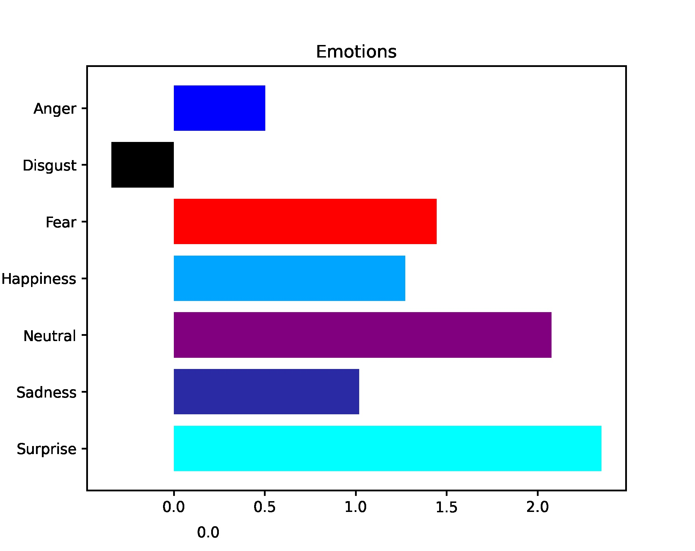

# Video-Based Eye Tracking

<p align="center">
  
</p>

## Overview
This repository contains a **video-based eye tracking system** that detects and analyzes eye movements using a webcam. The system processes video frames, aligns the camera, and extracts emotional insights based on detected eye movements.

## Installation and Setup
```sh
git clone https://github.com/Parmidajabbari/Video_based_eye_tracking.git
cd Video_based_eye_tracking
cd webapp
flask run
```

Once the Flask server is running, open your browser and go to:
```
http://127.0.0.1:5000/
```

## Usage
1. Click the **Start Task** button.
2. Align your camera properly.
3. Observe the displayed images and follow the on-screen instructions.
4. View the processed frames in `webapp/frames/processed/`.
5. Analyze the corresponding **emotion plots** generated from the eye tracking data.

## Sample Output
Below is an example of an **emotion plot** generated by the system:

<p align="center">
  
</p>

## Contributing
Contributions are welcome! Please feel free to submit issues or pull requests.

## License
This project is licensed under the MIT License.
